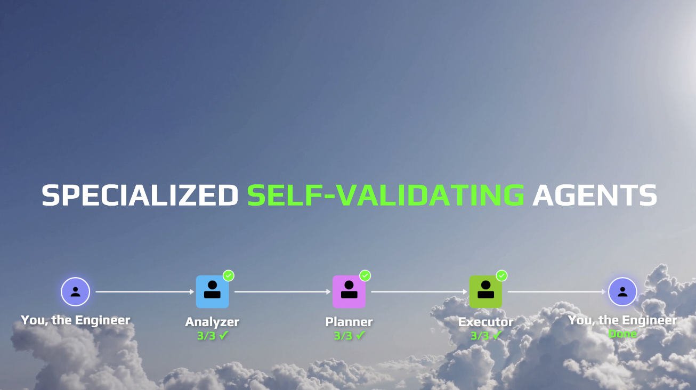

# Agentic Finance Review (Specialized Self-Validating Agents)

Autonomous finance review powered by Claude Code agentics with **specialized self-validating agents**.



## The Big Idea

If you want your agents to accomplish valuable work autonomously, they must be able to **validate their work**. Validation increases trust, and trust saves your most valuable engineering resource: **time**.

This project demonstrates how to build **specialized self-validating agents** using Claude Code's hooks system. Each agent is hyper-focused on one task and validates its own work using deterministic scripts.

```
Focused Agent + Specialized Validation = Trusted Automation
```

## Core Concepts

### Specialized Self-Validation

The key insight: **specialized hooks embed in prompts, subagents, and skills**.

Before this feature, hooks were global (in `settings.json`). Now you can define hooks that run only for specific agents, enabling:

- **CSV agents** that validate CSV structure after every file operation
- **Build agents** that run linters and type checkers on completion
- **UI agents** that validate HTML output

## Project Structure

```
.claude/
├── commands/          # Custom slash commands (prompts)
│   ├── csv-edit.md    # CSV editing with PostToolUse validation
│   ├── build.md       # Build command with Stop validation
│   └── review-finances.md  # Orchestrator command
├── agents/            # Subagents for parallel work
│   ├── csv-edit-agent.md
│   ├── normalize-csv-agent.md
│   └── generative-ui-agent.md
└── hooks/
    └── validators/    # Validation scripts
        ├── csv-single-validator.py
        ├── csv-validator.py
        ├── html-validator.py
        └── ...
```

## Building Specialized Self-Validating Agents

### Step 1: Create a Focused Prompt

Custom slash commands live in `.claude/commands/`. See [csv-edit.md](.claude/commands/csv-edit.md) for a complete example.

**Key frontmatter fields:**

| Field           | Purpose                                  |
| --------------- | ---------------------------------------- |
| `model`         | Which model to use (opus, sonnet, haiku) |
| `description`   | When Claude should invoke this command   |
| `argument-hint` | Shows users expected arguments           |
| `allowed-tools` | Restricts tool access for security/focus |
| `hooks`         | Specialized validation hooks             |

### Step 2: Create a Subagent

Subagents enable **parallelization** and **context isolation**. See [csv-edit-agent.md](.claude/agents/csv-edit-agent.md) for a complete example.

**Prompts vs Subagents:**

| Feature     | Prompt (Slash Command)         | Subagent                     |
| ----------- | ------------------------------ | ---------------------------- |
| Context     | Runs in current context        | Isolated context window      |
| Parallelism | Sequential                     | Can run multiple in parallel |
| Arguments   | Uses `$1`, `$2`, `$ARGUMENTS`  | Infers from prompt           |
| Invocation  | `/csv-edit file.csv "add row"` | "Use csv-edit-agent to..."   |

### Step 3: Write the Validator

Validators receive hook input via stdin as JSON and output a decision. See [csv-single-validator.py](.claude/hooks/validators/csv-single-validator.py) for a complete example.

**Exit codes matter:**

| Exit Code | Behavior                                   |
| --------- | ------------------------------------------ |
| 0         | Success - proceed normally                 |
| 2         | Blocking error - stderr fed back to Claude |
| Other     | Non-blocking error                         |

## Hook Types

| Hook Event    | When It Fires          | Use Case                   |
| ------------- | ---------------------- | -------------------------- |
| `PreToolUse`  | Before a tool runs     | Block dangerous operations |
| `PostToolUse` | After a tool completes | Validate output            |
| `Stop`        | When agent finishes    | Final validation/cleanup   |

**Examples in this repo:**
- **PostToolUse**: [csv-edit.md](.claude/commands/csv-edit.md) - validates after every Read/Edit/Write
- **Stop**: [build.md](.claude/commands/build.md) - runs linter + type checker on completion
- **Multiple Stop hooks**: [normalize-csv-agent.md](.claude/agents/normalize-csv-agent.md) - runs CSV + balance validation

## Real Examples

### CSV Edit with Self-Correction

```
User: /csv-edit savings.csv "add a row for a $100 deposit"

Agent: [Reads file]
Hook: [Validates CSV structure] ✓

Agent: [Edits file to add row]
Hook: [Validates CSV structure]
  ✗ Balance mismatch! Expected $1100, got $1000

Agent: [Fixes balance calculation]
Hook: [Validates CSV structure] ✓

Agent: "Added deposit row with correct balance."
```

### Multi-Agent Pipeline

The [/review-finances](.claude/commands/review-finances.md) orchestrator chains specialized agents:

```
/review-finances mar checkings.csv savings.csv
    │
    ├─> normalize-csv-agent (validates CSV + balance)
    ├─> categorize-csv-agent (validates CSV)
    ├─> merge-accounts-agent (validates merged output)
    ├─> graph-agent (validates PNG generation)
    └─> generative-ui-agent (validates HTML)
```

### Parallel Execution

```
User: "Use one CSV edit agent per file in mock-input-data/"

Claude: [Spawns 4 agents in parallel]
  ├─> csv-edit-agent (checkings.csv)
  ├─> csv-edit-agent (savings.csv)
  ├─> csv-edit-agent (credit.csv)
  └─> csv-edit-agent (expenses.csv)

[All 4 agents validate their work independently]
```

## Why Specialized Agents Win

A focused agent with one purpose **outperforms** an unfocused agent with many purposes.

| Approach                       | Result                               |
| ------------------------------ | ------------------------------------ |
| General agent doing everything | Works sometimes, fails unpredictably |
| Specialized agent + validation | Consistent, reliable, trustworthy    |

```
Specialization + Deterministic Validation = Trust
```

## Quick Start

### Mock Data

This repo includes mock CSV data for January, February, and March 2026 in `mock-input-data/`.

### Run the Full Pipeline

**March (fresh run):**
```bash
claude
> /review-finances mar mock-input-data/raw_checkings_mar.csv mock-input-data/raw_savings_mar.csv
```

**January or February (already processed):**

These months have existing output directories. Delete them first to re-run:
```bash
rm -rf apps/agentic-finance-review/data/mock_dataset_2026/mock_dataset_jan_1st_2026
rm -rf apps/agentic-finance-review/data/mock_dataset_2026/mock_dataset_feb_1st_2026
```

Then run:
```bash
claude
> /review-finances feb mock-input-data/raw_checkings_feb.csv mock-input-data/raw_savings_feb.csv
```

### Test Individual Commands

```bash
claude
> /csv-edit mock-input-data/raw_checkings_mar.csv "report on data structure"
```

### Run Parallel Agents

```bash
claude
> Use one csv-edit-agent per file in mock-input-data/ to report on the data structure
```

## Documentation

- [Claude Code Hooks](https://code.claude.com/docs/en/hooks)
- [Custom Slash Commands](https://code.claude.com/docs/en/slash-commands)
- [Subagents](https://code.claude.com/docs/en/sub-agents)
- [Agent Skills](https://code.claude.com/docs/en/skills)

## Key Takeaways

1. **Read the docs.** Actually read the documentation. Don't just paste it into your agent.
2. **Build focused agents.** One agent, one purpose, extraordinary results.
3. **Add specialized validation.** Every good engineer validates their work. Your agents should too.
4. **Use hooks strategically:** `PostToolUse` for each operation, `Stop` for final validation, `PreToolUse` to block dangerous operations.
5. **Log everything.** Observability is critical.

---

## Master Agentic Coding

> Prepare for the future of software engineering

Learn tactical agentic coding patterns with [Tactical Agentic Coding](https://agenticengineer.com/tactical-agentic-coding?y=ssvhooks)

Follow the [IndyDevDan YouTube channel](https://www.youtube.com/@indydevdan) to improve your agentic coding advantage.
